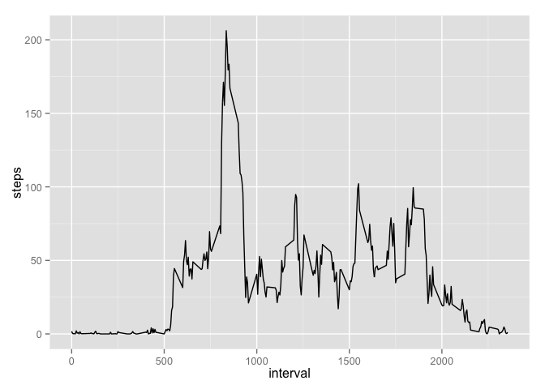

# Reproducible Research: Peer Assessment 1


## Loading and preprocessing the data
The step measurements should be in activity.csv in the same directory as
this R markdown document.

```r
steps <- read.csv('activity.csv')
steps$date <- as.Date(as.character(steps$date))
filteredSteps <- steps[!is.na(steps$steps),]
```

## What is mean total number of steps taken per day?

```r
library(ggplot2)
stepsByDate <- aggregate(steps ~ date, data = filteredSteps, FUN=sum)
totalStepsMean <- mean(stepsByDate$steps)
totalStepsMedian <- median(stepsByDate$steps)
dailyStepPlot <- qplot(steps, data=stepsByDate, geom="histogram")
print(dailyStepPlot)
```

```
## stat_bin: binwidth defaulted to range/30. Use 'binwidth = x' to adjust this.
```

 

The mean total number of steps taken a day is 1.0766189\times 10^{4}.

The median of the total number of steps taken a day is 10765.

## What is the average daily activity pattern?

```r
stepsByInterval <- aggregate(steps ~ interval, data = filteredSteps, FUN=mean)
maxMeanInterval <- stepsByInterval[stepsByInterval$steps == max(stepsByInterval$steps),"interval"]
print(ggplot(stepsByInterval, aes(interval, steps)) + geom_line())
```

 

The maximum mean number of steps taken on a typical day is during interval 835.

## Inputing missing values

```r
naSteps <- steps[is.na(steps$steps),]
naStepsCount <- nrow(naSteps)
fixedSteps <- steps
for (i in 1:nrow(fixedSteps)) {
    fixedStep = fixedSteps[i,]
    if (is.na(fixedStep$steps)) {
        fixedSteps$steps[i] = stepsByInterval[stepsByInterval$interval == fixedStep$interval,"steps"]
    }
}
fixedStepsByDate <- aggregate(steps ~ date, data = fixedSteps, FUN=sum)
fixedTotalStepsMean <- mean(fixedStepsByDate$steps)
fixedTotalStepsMedian <- median(fixedStepsByDate$steps)
print(qplot(steps, data=fixedStepsByDate, geom="histogram"))
```

```
## stat_bin: binwidth defaulted to range/30. Use 'binwidth = x' to adjust this.
```

 

The total number of missing values for measuring steps is 2304.

The strategy taken to add missing values is to replace the missing values with
the mean steps for the same interval across all days.

The mean total number of steps taken a day is 1.0766189\times 10^{4}.

The median of the total number of steps taken a day is 1.0766189\times 10^{4}.

The mean steps is the same as for the approach where we filter out missing values.

The median is now a fractional number instead of an integer number and happens
to be the mean. Median steps should always report an actual measured step which 
here is always an integer number of steps taken during an interval in a day.

## Are there differences in activity patterns between weekdays and weekends?

```r
fixedSteps$weekend <- factor(sapply(fixedSteps[,"date"], 
     function(x) {if(weekdays(x) %in% c('Saturday','Sunday')) "weekend" else "weekday"}))
weekendStepsByInterval <- 
    aggregate(steps ~ interval, data = fixedSteps[fixedSteps$weekend=="weekend",], FUN=mean)
weekdayStepsByInterval <- 
    aggregate(steps ~ interval, data = fixedSteps[fixedSteps$weekend=="weekday",], FUN=mean)
weekendPlot <- ggplot(weekendStepsByInterval, aes(interval, steps)) + geom_line() + 
    ggtitle("Weekend") + labs(x="Number of steps", y="Interval")
weekdayPlot <- ggplot(weekdayStepsByInterval, aes(interval, steps)) + geom_line() + 
    ggtitle("Weekday") + labs(x="Number of steps", y="Interval")
library(grid)
pushViewport(viewport(layout=grid.layout(2,1)))
print(weekendPlot,vp=viewport(layout.pos.row=1, layout.pos.col=1))
print(weekdayPlot,vp=viewport(layout.pos.row=2, layout.pos.col=1))
```

 

The graph above shows differences between weekend and weekday activities.
Activity during weekday is spiking at the same time during the day. During the
weekend, activity is more pronounced throughout the day.
